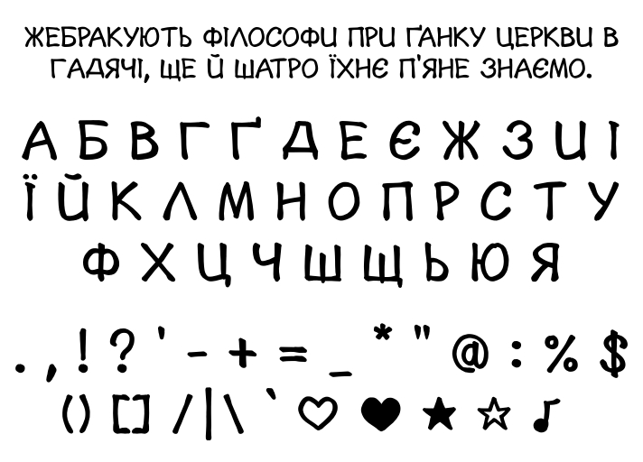
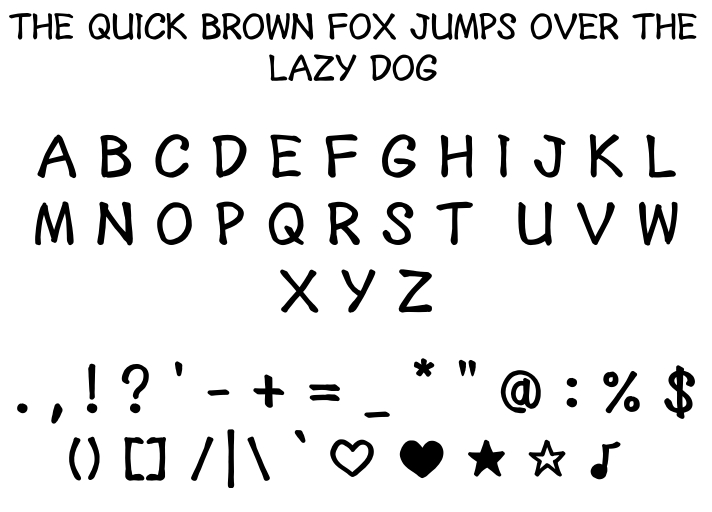

# Y.F.M
Цей шрифт було створено для безкоштовного та комерційного використання в перекладі манґи. Він підтримує не лише українську мову, а й **англійську**. Також є незначна кількість специфічних символів (♡, ♥, ★, ☆, ♪).

# Програми
У розробці використовувалися такі програми, як **FontForge** та **Inkscape**. Відповідно, якщо ви хочете внести якісь зміни, то вам доведеться встановити ці програми.

# Y.F.M - English Version
This font was designed for both free and commercial use in manga translation. It supports not only Ukrainian but also English. Additionally, it includes a small set of specific symbols (♡, ♥, ★, ☆, ♪).

# Software
The development process involved software such as FontForge and Inkscape. Accordingly, if you wish to make any modifications, you will need to have these programs installed.

## Ліцензія
Цей шрифт розповсюджується під ліцензією **SIL Open Font License 1.1**.

## License
This font is distributed under the SIL Open Font License 1.1.
